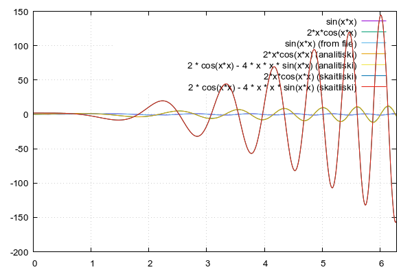

# Skaitliskās metodes - skaitliskā diferencēšana sin(x*x)
Funkcijas pieauguma un argumenta pieauguma attiecības robežu, kad argumenta pieaugums tiecas uz nulli, sauc par funkcijas atvasinājumu vai diferencēšanu.

Laboratorijas darba uzduvums ir uzrakstīt kodu, kas manai funkcijai ``sin(x*x)``, aprēķinātu pirmās un otrās kārtas atvasinājumu ar divām dažādām metodēm, analītisko un skaitlisko, jeb diferencēšanu uz priekšu. Kā arī lietotājam tiek prasīts ievadīt vērtības ``a`` un ``b``, kas parāda intervālu kādā tiks meklēts atvasinājums. Lietotājam ir jāievada arī precizitāte, jeb solis pēc, pēc kura tiks veikta nākamā interācija.

### Koda piemērs
```
#undef __STRICT_ANSI__

#include <stdio.h>
#include <math.h>

void main()
{
 float a = 0. ,b = 2 * M_PI, x, delta_x = 1.e-2;
 //floaty;
 printf("     x  \t    sin(x*x)  \t   sin\'an(x)  \t   sin\''an(x)  \t  'sk(x)  \t  ''sk(x)\n");
 x = a;
 while(x < b)
 {
//y=sin(x);
  printf("%8.2f\t%8.2f\t%8.2f\t%8.2f\t%8.2f\t%8.2f\n" ,x, sin(x*x), 2*x * cos(x*x),2 * cos(x*x) - 4 * x * x * sin(x*x), (sin((x + delta_x) * (x + delta_x)) - sin(x*x)) / delta_x, (sin((x + delta_x) * (x + delta_x)) - 2 * sin(x * x) + sin((x - delta_x) * (x - delta_x))) / (delta_x * delta_x));
;
  //printf(”%10.2f\t%10.2f\n”,x,y);
  x += delta_x; //x=x+delta_x;
 }
}
```
```
float a = 0. ,b = 2 * M_PI, x, delta_x = 1.e-2;
```
Šajā koda rindiņā tiek parādīts, ka mainīgā `x` intervāls ir no `0 līdz 2 * pi` un solis jeb precizitāte pēc cik tiks aprēķināta nākamā funkcijas vērtība, kas tieši šajā gadījumā ir ``1*10^-2 jeb 0.01``.

### Veids kā iegūt dialogu ar lietotāju nepieciešamo vērtību iegūšanai
```
int main(){
float a, b , x, delta_x;

printf("Ievadiet funkcijas intervāla robežu no kreisās puses - \n");
scanf("%f", &a);

printf("Ievadiet funkcijas intervāla robežu no labās puses - \n");
scanf("%f", &b);

printf("Ievadiet precizitāti - \n");
scanf("%f", &delta_x);
...
```
### Skaidrojums, kā notiek atvasinājuma vērtības aprēķināšana:
```
x, sin(x*x), 2*x * cos(x*x),2 * cos(x*x) - 4 * x * x * sin(x*x)
```
`x` mainās no ``0 līdz 2 * pi``, katru interāciju mainoties par uzdoto precizitāti, kas ir ``0,01``

``sin(x*x)`` ir funkcijas vērtība atkarībā no x vērtības.

`` 2*x * cos(x*x)`` ir pirmās kārtas analītiskais atvasinājums funkcijai sin(x*x)

``2 * cos(x*x) - 4 * x * x * sin(x*x)`` ir otrās kārtas analītiskais atvasinājums funkcijai sin(x*x)
```
(sin((x + delta_x) * (x + delta_x)) - sin(x*x)) / delta_x
```
Ir funkcijas ``sin(x*x)`` pirmās kārtas skaitliskais atvasinājums. 
``sin((x + delta_x) * (x + delta_x))`` šī daļa aprēķina funkcijas vērtību punktā ``x + delta_x``.
tālāk tiek atņemta ``sin(x*x)``, kas vērtība punktā ``x`` un iepriekš minēto vērtību starpību izdala ar ``delta_x`` jeb soli (intervālu pa kuru tiek veikta diferencēšana) iegūstot skaitlisko atvasinājumu.

```
(sin((x + delta_x) * (x + delta_x)) - 2 * sin(x * x) + sin((x - delta_x) * (x - delta_x))) / (delta_x * delta_x)
```
Ir funkcijas ``sin(x*x)`` otrās kārtas skaitliskais atvasinājums.
``sin((x + delta_x) * (x + delta_x))`` ir funkcijas vērtība labajā pusē no x, jeb ``x + delta_x``.
``sin((x - delta_x) * (x - delta_x))`` ir funkcijas vērtība kreisajā pusē no x jeb ``x - delta_x``.
``sin(x * x)`` ir funkcijas vērtība punktā ``x``.
``delta_x`` ir vērtība, kas nosaka soli (intervālu pa kuru tiek veikta diferencēšana).
Formula, principā, iskaidro to, ka otrās kārtas atvasinājums ir tuvināta vērtību izmaiņa divos punktos - pa labi un pa kreisi no punkta ``x`` dalīta ar ``delta_x * delta_x``.


Skaitlisko atvasinājumu izmanto, ja nav pieejams analītiskais atvasinājums, vai arī tas ir ļoti sarežģīts vai arī, ja funkcija ir dota tikai ar skaitliskiem punktiem, nevis ar konkrētu analītisku formulu.

Skaitliskais atvasinājums ir precīzāks nekā analītiskais, protams liela nozīmē šajā gadījumā ir izvēlētajam solim, jeb precizitātei.

### Gnuplot koda piemērs 
```
#!/usr/bin/gnuplot --persist
#set terminal pngcairo transparent enhanced font "arial,10" fontscale 1.0 size 600, 400 
set terminal pngcairo enhanced font "arial,10" fontscale 1.0 size 600, 400 
set output 'atvasin+.png'

set grid

#plot [0:2*pi] sin(x*x)
#replot [0:2*pi] 2*x * cos(x*x) title "2x*cos(x*x)"
#replot "atvasin.dat" every ::1 using 1:2 with lines title "sin(x*x) (from file)",
#replot "atvasin.dat" every ::1 using 1:3 with lines title "sin'(x*x) (finite difference)"

plot [0:2*pi] sin(x*x), 2*x*cos(x*x), \
              "atvasin+.dat" every ::1 using 1:2 with lines title "sin(x*x) (from file)", \
              "atvasin+.dat" every ::1 using 1:3 with lines title "2*x*cos(x*x) (analitiski)", \
              "atvasin+.dat" every ::1 using 1:4 with lines title "2 * cos(x*x) - 4 * x * x * sin(x*x) (analitiski)", \
              "atvasin+.dat" every ::1 using 1:4 with lines title "2*x*cos(x*x) (skaitliski)", \
              "atvasin+.dat" every ::1 using 1:4 with lines title "2 * cos(x*x) - 4 * x * x * sin(x*x) (skaitliski)"
 
```

​

Attēlojot datus vizuāli, ir redzami tikai 3 garfiki, jo pirmās un otrās kārtas skaitliskie un analītiskie atvasinājumi atšķiras ar ļoti mazu vērtību. 