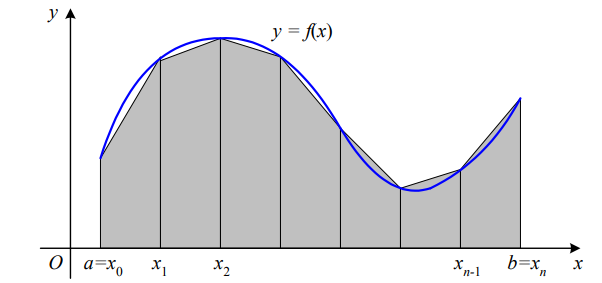

# Skaitliskās metodes - skaitliskā integrēšana - sin(x * x)

Noteiktos integrāļus plaši izmanto ģeometrijā, mehānikā, fizikā, ķīmijā un
ekonomikā.  Ja zemintegrāļa funkcija ir viegli integrējama, noteiktā integrāļa aprēķināšana
nesagādā grūtības. Taču praktiskajos uzdevumos integrāļi bieži vien ir sarežģīti, grūti
integrējami vai arī elementāri neintegrējami. Šādos gadījumos noteikto integrāli var
aprēķināt tuvināti, izmantojot skaitliskas metodes.

Tieši šāds ir šī laboratorijas darba uzdevums. Izmantojot skaitliskās integrēšanas metodes aprēķināt integrāļa vērtību funkcijai ``sin(x*x)``.

Ir trīs galvenās metodes noteiktā integrāļa aprēķināšanai:
### Taisnstūru metode
### Trapeču metode 
### Simpsona metode
Visas trīs minētās metodes balstās uz noteiktā integrāļa ģeometrisko interpretāciju:
Noteiktais integrālis sakrīt ar laukumu plaknes figūrai, kuru no apakšas ierobežo Ox ass, no augšas – funkcijas ``y = f (x)`` grafiks, no sāniem – vertikālas
taisnes ``x = a un x = b``.

### Taisnstūru metode
```
#undef __STRICT_ANSI__
#include <stdio.h>
#include <math.h>

void main(){
float a = 0. ,b = M_PI/2, eps=1.e-3, h, integr1 = 0. ,integr2, x;
int k, n=2;

integr2 =(b-a)*(sin(a*a)+sin(b*b))/n;
while(fabs(integr2-integr1)>eps)
{
   n*=2;
   h=(b-a)/n;
   integr1 = integr2;
   integr2 = 0.0;
   for(k=0;k<n;k++)
    {
       x = (a+(k+0.5) *h); 
       integr2+= h*sin(x*x);

    }


      printf("(elementu skaits - %d) Integraalja veertiiba: %.4f \n",n, integr2);
}
printf("Integralja vertiba : %.2f\n", integr2);
}
```
Integrēšanas intervāls [a:b], kas šajā konkrētajā gadījumā ir ``no 0 līdz pi/2`` tiek sākumā sadalīts vienādās ``n`` daļās, jeb taisnstūros. 

Taisnstūru platumu nosaka pēc formulas ``(b-a)/n``, garumu apzīmē ar burtu h un sauc par integrēšanas soli.

Tālāk tiek aprēķināta funkcijas vērtība katra nogriežņa galapunktā pēc formulas ``y(i) = f(xi)``
Šīs vērtības y1, y2, …, yn sakrīt ar taisnstūru augstumiem. Šo taisnstūru laukumi ir vienādi ar - 

``S = f(xi) * (b-a)/n = y(i) * h``
`
Noteiktais integrālis ir aptuveni vienāds ar izveidoto taisnstūru laukumu summu. Aprēķina kļūda samazinās, ja samazina integrēšanas soli h, ko savukārt izdara, palielinot integrēšanas intervāla dalījuma punktu skaitu n, kā tas ir izdarīts redzamajā kodā, ka interāciju skaits, jeb elementu skaits palielinās līdz vērtība ir aprēķināta ar uzdoto precizitāti.

Taisnstūra metodes vizualizācija varētu izskatīties šādi:

### Trapeču metode 
```
#include <stdio.h>
#include <math.h>

int main() {
    float a = 0.0, b = M_PI/2, eps = 1.e-3, h, integr1 = 0.0, integr2, x;
    int k, n = 2;

    integr2 = (b - a) / 2.0 * (sin(a * a) + sin(b * b));

    while(fabs(integr2 - integr1) > eps) {
        n *= 2;
        h = (b - a) / n;
        integr1 = integr2;
        integr2 = 0.0;

        for(k = 0; k < n; k++) {
            x = a + (k + 0.5) * h;
            integr2 += h * sin(x * x);
        }

        printf("(elementu skaits - %d) Integraalja veertiiba: %.4f \n", n, integr2);
    }

    printf("Integralja vertiba : %.2f\n", integr2);

    return 0;
}

```
Tāpat kā taisnstūru metodē, integrēšanas intervāls [a:b] tiek sadalīts ``n`` vienādās daļās.
Katra iegūtā nogriežņa garums ``h = (b-a)/n``.
Caur iegūtajiem punktiem x0, x1, x2 ... tiek novilktas vertikālas taisnes.
Šo taišņu un funkcijas grafika tuvākie krustpunkti tiek  savienoti ar taisnes nogriežņiem,
izveidojot lauztu līniju. 
Visu trapeču laukumu summa ir aptuvenā integrāļa vērtība, kas aprēķināta pēc formulas - 

``S = h * (yi - 1 + y1)/2``
kur: y1 = f(xi)
i = 1, 2, 3, ....

Trapeču metodes vizualizācija varētu izskatīties šādi:


Tāpat kā taisnstūru metodē, aprēķina kļūda samazinās, ja samazina integrēšanas soli h jeb palielina integrēšanas intervāla dalījuma punktu skaitu n.

### Simpsona metode
Simpsona metode integrēšanas intervālu sadala pāru skaita intervālos ``n = 2*m``. Laukums uzreiz tiek aprēķināts 2 intervāliem, kuru robežās funkcija tiek aproksimēta ar otrās kārtas polinomu.

Soļa lielums ir ``h = (b-a)/n`` 
Metode pamatojas uz to, ka, izmantojot 3 argumenta un 3 funkcijas vērtības, tiek sastādīta un analītiski atrisināta vienādojumu sistēma ``C2 * x^2 + C1 * x + C0 = y``

Savu kodu, integrāļa aprēķināšanai ar Simpsona metodi, es rakstīju balstoties uz J. Ziemeļa lekciju konspektu ``Ievads algoritmu valodā C``.

```
#undef __STRICT_ANSI__
#include <stdio.h>
#include <math.h>

double f(double x) {
    
    return sin(x*x);
}

int main() {
    int k, n, m = 1;
    double a = 0.0, b = M_PI / 2.0, eps = 1.e-3, h, integr1 = 0.0, integr2;

    integr2 = (b - a) * (f(a) + f(b)) / 2.0;

    while (fabs(integr2 - integr1) > eps) {
        m *= 2;
        n = 2 * m;
        h = (b - a) / n;
        integr1 = integr2;
        integr2 = 0.0;

        for (k = 1; k <= m - 1; k++)
            integr2 = integr2 + 2.0 * (2.0 * f(a + (2 * k - 1) * h) + f(a + 2 * k * h));

        integr2 = integr2 + f(a) + f(b) + 4.0 * f(b - h);
        integr2 *= h / 3.0;
    }

    printf("Integralja vertiba : %.4f\n", integr2);
    return 0;
}

```
J. Ziemeļa grāmatā ir atrodami kodu piemēri ar skaitlisko integrēšanu, un tas viss ļoti labi paskaidrots.

Ļoti labs avots, kur pasakaidrota skaitliskā integrēšana ir https://estudijas.rtu.lv/file.php/63844/Skaitliskas_metodes/not.int.aprek.pdf

Nokompilējot visus trīs kodus, integrāļa vērtībai ir jābūt vienādai, kas ir ``0.83``.

Integrāļa vērtību var pārbaudīt izmantojot https://www.wolframalpha.com/input?i=integral+sin%28x%5E2%29+from+0+to+pi%2F2

Ekrānuzņēmums no Wolframalpha 