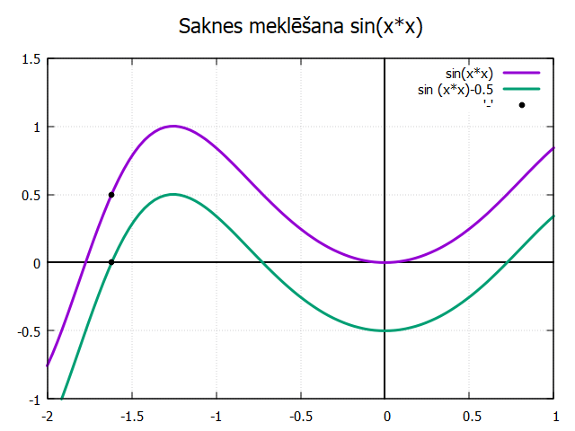

# Skaitliskās metodes - Dihotomijas metode - sin(x*x)
Dihotomijas metode ir viena no vienkāršākajām un efektīvākajām metodēm, ko izmanto, lai atrastu meklējamu vērtību noteiktā jau sakārtotā sarakstā vai masīvā. Tā ir ļoti noderīga, ja jāatrod konkrēta vērtība sakārtotā sarakstā, jo tā ļauj ātri sašaurināt meklēšanas diapazonu. Labaratorijas darbā pielietojot šo metodi mēs atrodam funkcijas sakni, jeb pietuvojamies 'x' vērtībai pie kuras funkcija krustos 'x' asi, citiem vārdiem sakot maina zīmi.

Pirmajā kodā ir parādīts, kā var atrast sakni parastai funkcijai `sin(x*x)`
```
#undef __STRICT_ANSI__
#include <stdio.h>
#include <math.h>
int main(){
    float a = 0.01, b = 1.5 * M_PI, x, delta_x = 1.e-3/*0.0001*/, funkca, funkcb, funkcx;
    int k = 0;
    funkca = sin (a * a); funkcb = sin (b * b);
    if (funkca * funkcb >0){
        printf("intervaala [%.2f;%.2f] sin(x * x) funkcijai ",a ,b);
        printf("saknju nav (vai taaja ir paaru saknju skaits)\n");
        return 1;}

    printf("               sin(%7.3f)=%7.3f\t\t\t\t", a, sin (a * a));
    printf("sin(%7.3f)=%7.3f\n", b, sin (b * b));

    while((b-a) > delta_x){
        k++;
        x = (a+b) / 2.;
        if(funkca * sin (x * x) > 0)
        a = x;
    else
    b = x;
    printf("%2d. interacija: sin (%7.3f) = %7.3f\t", k, a, sin(a * a));
    printf("sin(%7.3f) = %7.3f\t", x, sin(x * x));
    printf("sin(%7.3f) = %7.3f\n", b, sin(b * b));}

    printf("Saakne atrodas pie x = %.3f, jo sin(x) ir %.3f\n", x, sin (x * x));
    return 0;}


```
Viena no svarīgākajām lietām, kas jāņem vērā, lai varētu pietuvoties saknes vērtībai ir intervāls, kam jābūt tādam, lai fuknkcijai šajā intervālā būtu tikai viens krustpunkts ar `x asi`, citādi kods nevar nevar saprast vai intervālā nemaz nav sakņu, vai arī ir pāra sakņu skaits, jo mūsu kods konstatē vai funkcijas zīme ir mainījusies vai nē, ja ir, piemēram, divas saknes, tad pēc vienkāršākajiem matemātikas principiem zīme nemainās un nav zināms vai intervālā ir sakne.

Otrajā kodā ir parādīts, kā pārbīdīt grafiku `y ass` pozitīvajā vai negatīvajā virzienā.
```
#undef __STRICT_ANSI__
#include <stdio.h>
#include <math.h>

float modified_sin2(float x, float A){
    return sin(x * x)-A;}

    void main(){
        float a, x, delta_x, b, y, A;
        a = 0;
        b = 2*M_PI;

        printf("Cien. liet., luudzu, ievadiet A veertibu sekojošajam vienadojumam:sin(x * x)=A\n");
        scanf("%f", &A);
        x = a;
        delta_x = 0.1;
        printf("\tx\ty\n");
        while(x<b)
        {
            printf("%10.1f%10.1f\n", x, modified_sin2(x,A));
            x += delta_x;
        }


    }


```
Savienojot kopā pirmo kodu ar otro, pielāgoju to tā, lai lietotājam prasītu ievadīt vērtību `A`, par kuru funkcija tiks nobīdīta `y` ass virzienā, tālāk tiek prasīts ievadīt arī itervālu, kādā tiks meklēta sakne, un visbeidzot arī preciziitāti ar kādu jāpietuvojas saknei. Izpildot kodu tiek atrasta sakne pārbīdītajai funkcijai.

Trešajā kodā ir parādīts kā atrast saki pārbīdītai `sin(x*x) funkcijai`

```
#include <stdio.h>
#include <math.h>
int main(){
    float a, b, x, A, delta_x, funkca, funkcb, funkcx;
    int k = 0;
    printf("Cien. liet., lūdzu, ievadiet A vēertibu sekojošajam vienadojumam:sin(x * x)=A\n");
    scanf("%f", &A);

    printf("Cien. liet., lūdzu ievadiet ievadiet intervāla robežu no kreisās puses : \n");
    scanf("%f", &a);

    printf("Ievadiet intervāla robežu no labās puses : \n");
    scanf("%f", &b);


    printf("Ievadiet precizitāti ar kādu vēlaties pietuvoties funkcijas saknei: \n");
    scanf("%f", &delta_x);
    funkca = sin (a * a)-A; funkcb = sin (b * b)-A;
    if (funkca * funkcb >0){
        printf("intervaala [%.2f;%.2f] sin(x * x) funkcijai ",a ,b);
        printf("saknju nav (vai taaja ir paaru saknju skaits)\n");
        return 1;}

    printf("               sin(%7.3f)=%7.3f\t\t\t\t", a, sin (a * a)-A);
    printf("sin(%7.3f)=%7.3f\n", b, sin (b * b)-A);

    while((b-a) > delta_x){
        k++;
        x = (a+b) / 2.;
        if(funkca * (sin (x * x)-A) > 0)
        a = x;
    else
        b = x;
    printf("%2d. interacija: sin (%7.3f) = %7.3f\t", k, a, sin(a * a)-A);
    printf("sin(%7.3f) = %7.3f\t", x, sin(x * x)-A);
    printf("sin(%7.3f) = %7.3f\n", b, sin(b * b)-A);
    
    }

    printf("Saakne atrodas pie x = %.3f, jo sin(x) ir %.3f\n", x, sin (x * x));
    return 0;
    
}

```

Piemērs grafika izveidošanai ar gnuplot.
```
gnuplot> set title "Saknes meklēšana sin(x*x)" font ",14"      
gnuplot> set xrange [-2:1]                                
gnuplot> set yrange [-1:1.5]                              
gnuplot> set xzeroaxis lt 1 lc rgb 'black' lw 2           
gnuplot> set yzeroaxis lt 1 lc rgb 'black' lw 2  
gnuplot> plot sin(x*x) lw 3, sin (x*x)-0.5 lw 3           
gnuplot> replot '-' w p ls 1 pt 7                         
input data ('e' ends) > -1.618 0
input data ('e' ends) > -1.618 0.5
input data ('e' ends) > e
gnuplot> replot                                           
```
Piemērs koda izvadei, pēc kura ir balstīts izveidotais grafiks.
```
Cien. liet., lūdzu, ievadiet A vēertibu sekojošajam vienadojumam:sin(x * x)=A
0.5
Cien. liet., lūdzu ievadiet ievadiet intervāla robežu no kreisās puses :
-2
Ievadiet intervāla robežu no labās puses :
-1.5
Ievadiet precizitāti ar kādu vēlaties pietuvoties funkcijas saknei:
0.001
               sin( -2.000)= -1.257                             sin( -1.500)=  0.278
 1. interacija: sin ( -1.750) =  -0.421 sin( -1.750) =  -0.421  sin( -1.500) =   0.278
 2. interacija: sin ( -1.625) =  -0.020 sin( -1.625) =  -0.020  sin( -1.500) =   0.278
 3. interacija: sin ( -1.625) =  -0.020 sin( -1.563) =   0.144  sin( -1.563) =   0.144
 4. interacija: sin ( -1.625) =  -0.020 sin( -1.594) =   0.066  sin( -1.594) =   0.066
 5. interacija: sin ( -1.625) =  -0.020 sin( -1.609) =   0.024  sin( -1.609) =   0.024
 6. interacija: sin ( -1.625) =  -0.020 sin( -1.617) =   0.002  sin( -1.617) =   0.002
 7. interacija: sin ( -1.621) =  -0.009 sin( -1.621) =  -0.009  sin( -1.617) =   0.002
 8. interacija: sin ( -1.619) =  -0.003 sin( -1.619) =  -0.003  sin( -1.617) =   0.002
 9. interacija: sin ( -1.618) =  -0.000 sin( -1.618) =  -0.000  sin( -1.617) =   0.002
Saakne atrodas pie x = -1.618, jo sin(x) ir 0.500
```


Kā redzam, lietotājs vēlas uzzināt vai funkcijai pie A vērtības 0.5 ir saknes intervālā [-2:-1.5], tāpēc grafiks tiek nobīdīts tieši par 0.5 uz leju y ass virzienā un ,kā mēs redzam grafikā, funkcija `sin(x*x)-0.5` krusto x asi dotajā intervālā vienu rezi, pie x vērtības `-1.618`